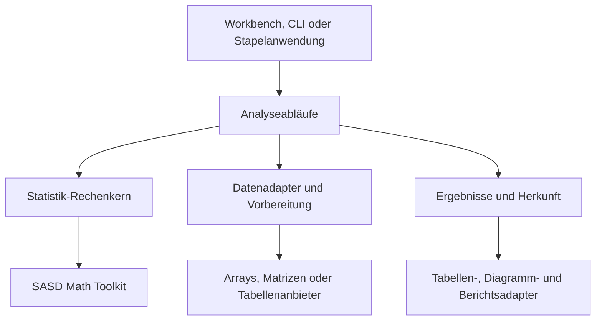

# Architektur

[English](../en/ARCHITECTURE.md)

## Abhängigkeitsrichtung

Pfeile bedeuten verwendet. Anwendungen verwenden auch Exportadapter; Renderer
rufen nicht in numerische Kerne zurück. Math hängt nicht von diesem Repository ab.

| Schicht | Verantwortung | Außerhalb |
| --- | --- | --- |
| Numerische Grundlage | Löser, Faktorisierungen, allgemeine Optimierung, spezielle Funktionen | Statistische Modellinterpretation |
| Statistik-Rechenkern | Kennzahlen, Verteilungen, Schätzer, Tests, Modelle, Diagnostik | Dateizugriff, Dateneditor, Renderer |
| Vorbereitung/Adapter | Variablenauswahl, Filter, Gruppen, Kodierung, Fehlwertmasken | Versteckte Änderungen an Quelldaten |
| Ablaufdienste | Verfahrensregister, versionierte Aufträge, Prüfung, Ausführung, Herkunft | GUI-Komponenten, globale veränderliche Optionen |
| Ausgabeadapter | Strukturierte Tabellen, Diagrammdaten, exportierbare Berichte | Neuberechnung aus gerundeten Ergebnissen |
| Anwendungen | Interaktive/Stapelsteuerung, Speicherung, Darstellung | Alternative Statistikimplementierungen |

Dies sind logische Module und keine Festlegung auf sechs Pakete. Die Paketaufteilung
wird mit der ersten Implementierung entschieden.

## Daten- und Ergebnisverträge

Basisverfahren akzeptieren endliche Zahlenfolgen, ausgerichtete Paare oder Matrizen
mit ausdrücklichen Dimensionen und Anordnung. Sie verlangen kein Tabellenframework.
Adapter liefern numerische Beobachtungen, Metadaten, Fehlwertinformationen und
Anzahlen, bestimmen Auswahl-/Kodierregeln und erhalten die Identität der Quellzeilen.

Ein Analyseauftrag nennt Verfahren/Vertragsversion, Spalten oder Zahlendaten,
Gruppen, Fehlwertregel, Optionen und Zufallssteuerung. Ein Ergebnis enthält
typisierte Schätzwerte, Beobachtungsanzahlen, Diagnostik, Warnungen, Annahmen und
Herkunft. Einzelne Schätzwerte dürfen unabhängig fehlen: Ein Einzelwert besitzt
Mittelwert und Populationsvarianz, aber keine Stichprobenvarianz.

Undefinierte Größen werden nicht zu null. Übersetzte Meldungen bleiben von stabilen
Statuscodes getrennt. Ungültige Aufrufe verwenden die sprachübliche Fehlerbehandlung;
fachlich undefinierte Ergebnisse verwenden das gemeinsame Ergebnisvokabular.

## Sprachverantwortung

- src/cpp und src/dotnet sind gleichrangig; keine ruft standardmäßig die andere auf.
- tests/cpp und tests/dotnet führen gemeinsame Fälle über getrennte Testprogramme aus.
- samples/cpp und samples/dotnet enthalten unabhängige ausführbare Beispiele.
- docs/implementations/cpp und docs/implementations/dotnet enthalten getrennte EN/DE-Handbücher.
- spec und conformance enthalten ausschließlich gemeinsame Verträge und Referenznachweise.

Eine spätere optionale native Brücke benötigt einen eigenen Vertrag für ABI,
Verteilung, Präzision und Fehler. Die erste Sprachimplementierung braucht sie nicht.

## Beispiele der Numerikgrenze

Allgemeine QR-/SVD-Lösungen für Least Squares gehören zu Math. Statistische
Designmatrizen, Faktorkontraste, Koeffizienteninferenz, Residuen und Modellvergleiche
gehören hierher. Allgemeine unvollständige Beta-/Gammafunktionen gehören zu Math;
Parametrisierung, Verteilungsseiten, Quantile und Testbedeutung hierher.

Laufende Mittelwert-/Varianzakkumulatoren sind statistische Objekte. Ihre zentrierten
Aktualisierungen gehören hierher. Wiederverwendbare kompensierte Summation kann
bei Bedarf als allgemeiner Baustein in Math angefordert werden.

## Änderungssteuerung

Verfahrensverträge und Ergebnisschemata werden ausdrücklich versioniert. Zusätzliche
optionale Diagnostik kann kompatibel sein; geänderte Quantildefinitionen oder
Ausschlussregeln verändern Ergebnisse und verlangen neue Vertragsversionen.
Paketversionen allein bestimmen kein statistisches Verhalten. Die Release-Matrix
dokumentiert beides.
