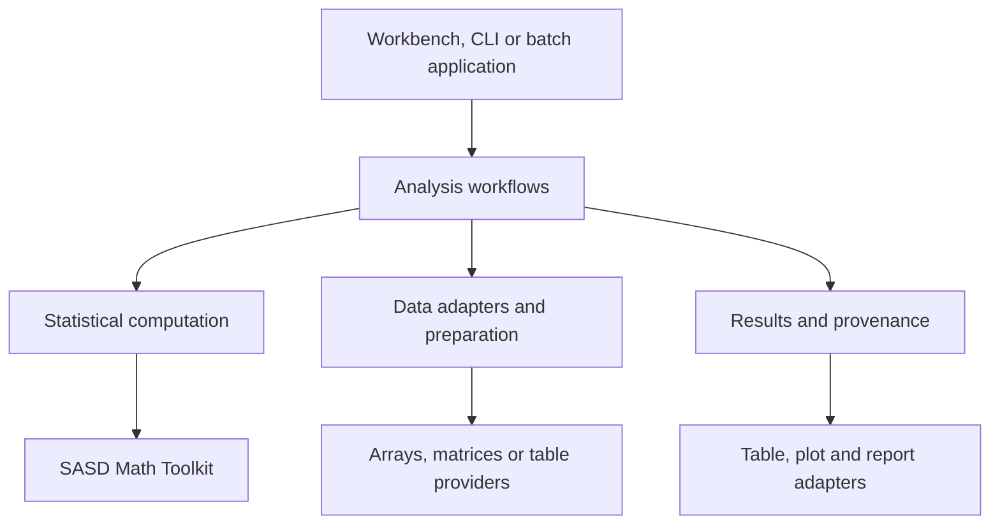

# Architecture

[Deutsch](../de/ARCHITECTURE.md)

## Dependency direction

Arrows mean uses. Applications consume export adapters as well; renderers do not
call back into numerical kernels. Math has no dependency on this repository.

| Layer | Owns | Excludes |
| --- | --- | --- |
| Numerical foundation | Solvers, factorizations, generic optimization and special functions | Statistical model interpretation |
| Statistical computation | Summaries, distributions, estimators, tests, models, diagnostics | File I/O, data editor, renderers |
| Preparation/adapters | Variable selection, filtering, grouping, encodings, missing masks | Hidden changes to source data |
| Workflow services | Procedure registry, versioned requests, validation, execution and provenance | GUI controls, global mutable options |
| Output adapters | Structured tables, plot data, export-ready reports | Recalculation from rounded output |
| Applications | Interactive/batch orchestration, storage and presentation | Alternative implementations of statistics |

These are logical modules, not a commitment to six packages. Packaging is decided
with the first implementation to avoid unnecessary dependency complexity.

## Data and result contracts

Low-level procedures accept finite numeric sequences, aligned pairs or matrices
with explicit shape/order. They do not require a table framework. An adapter
supplies numeric observations plus metadata, missingness and accounting; it owns
selection and encoding rules and preserves source row identity.

An analysis request identifies the procedure/contract version, columns or numeric
input, grouping, missingness policy, method options and randomness. An analysis
result carries typed estimates, observation counts, diagnostics, warnings,
assumptions and provenance. Estimates can be unavailable independently: a
singleton has a mean and population variance but no sample variance.

Undefined quantities must not become zero. Localized messages are separate from
stable status codes. The language binding maps malformed calls to its conventional
error mechanism; domain-level undefined results use the shared result vocabulary.

## Language ownership

- src/cpp and src/dotnet are peer implementations; neither calls the other by default.
- tests/cpp and tests/dotnet run the shared conformance cases through separate runners.
- samples/cpp and samples/dotnet contain independent runnable examples.
- docs/implementations/cpp and docs/implementations/dotnet contain separate EN/DE handbooks.
- spec and conformance contain only shared contracts and reference evidence.

A future optional native bridge requires its own ABI, deployment, precision and
failure contract. It is not necessary for first-language delivery.

## Numerical boundary examples

General QR/SVD least-squares solving belongs to Math. Statistical design matrices,
factor contrasts, coefficient inference, residual analysis and model comparison
belong here. Generic incomplete beta/gamma functions belong to Math; distribution
parameterization, tails, quantiles and hypothesis-test meaning belong here.

Online mean/variance accumulators are statistical objects. Their centered update
logic belongs here; generic compensated summation primitives can be requested
from Math if reusable across toolkits.

## Change control

Procedure contracts and result schemas evolve explicitly. Adding an optional
diagnostic can be compatible; changing a quantile definition or omitted-row
rule changes results and requires a new contract version. Package versions alone
do not identify statistical behavior. The release matrix records both.
